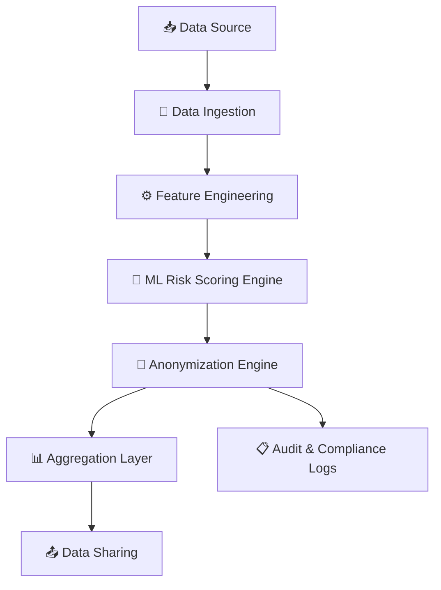
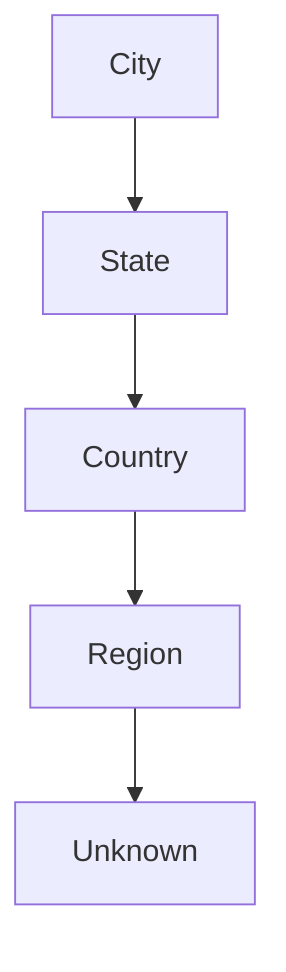
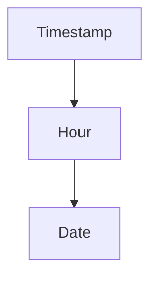
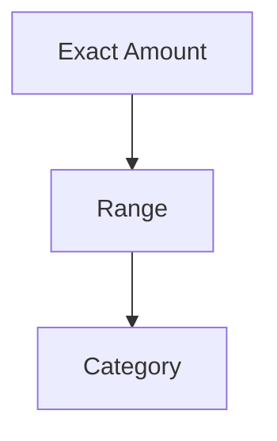

# 🚀 Policy-Aware Data Sharing System

### ML-Based Privacy Risk Modeling for Cross-Border Compliance

---

## 🌍 Overview

In the current situation, data must flow across regions. However, regulations such as **Executive Order 14117** restrict the transfer of sensitive personal data across borders. Specifically countries which are barned by the country itself, have a support team working on those countries makes it more complicated to share information while follow in the **EO 14117** guidelines.

This project presents a **Policy-Aware Data Sharing System** that:

* Detects privacy risks using Machine Learning which we need to avoid sharing 
* Using k-anonymity (k = 5), making sure we are within the compliance 
* As strictly as possible anonymizes sensitive data so that it will be ready for sharing
* Keeping analytical utility for business use to avoid any incorrect calculation to minimum

---

## 🧠 Problem Statement

A global app marketplace based in the USA collects large-scale user data, including:

* App downloads and engagement
* Device-level identifiers
* Payment information
* Location and timestamp data

A regional analytics team which is in Mainland China, requires access to this data to improve performance and user experience. However:

* The dataset contains sensitive and identifiable attributes
* Regulations restrict sharing such data directly

### 🎯 Objective

Design a system that:

* Prevents re-identification
* Ensures regulatory compliance
* Retains analytical value

---

## 💡 Proposed Solution

We design a **Policy-Aware Decision System** that:

1. Evaluates re-identification risk using ML
2. Applies anonymization techniques
3. Ensures compliance before data sharing

---

## 🏗️ System Architecture



---

## 🔄 Daily Processing Pipeline

```mermaid
flowchart LR
    A[Load Daily Data] --> B[Data Cleaning]
    B --> C[Feature Engineering]
    C --> D[Risk Prediction (ML)]
    D --> E[Anonymization]
    E --> F[Recalculate Risk]
    F --> G[Aggregation]
    G --> H[Audit Logging]
    H --> I[Export Final Dataset]
```

---

## 🧩 Dataset Structure

### 🔑 Identifiers

* device_id
* CVRoot

### 📍 Quasi-Identifiers

* timestamp
* country, state, city
* device_type
* language
* user_age_group

### 🔒 Sensitive Attributes

* payment_amount
* payment_method
* app_category
* session_duration

### ⚙️ Operational Fields

* product_name
* install_success
* AppVersion
* OSversion

---

## ⚙️ Feature Engineering

We derive features to quantify re-identification risk:

| Feature              | Description                        |
| -------------------- | ---------------------------------- |
| group_size           | Number of records in same group    |
| uniqueness_score     | 1 / group size                     |
| rarity_score         | Frequency of attribute combination |
| location_granularity | City vs State vs Country           |
| time_granularity     | Timestamp vs Date                  |
| sensitive_count      | Number of sensitive attributes     |

---

## 🤖 ML Risk Model

* Model: Logistic Regression
* Input: Engineered features
* Output: Risk score (0–1)

### 📊 Risk Interpretation

| Score Range | Action        |
| ----------- | ------------- |
| 0 – 0.3     | ✅ Share       |
| 0.3 – 0.7   | ⚠️ Generalize |
| 0.7 – 1.0   | ❌ Suppress    |

---

## 🔐 Anonymization Strategy

### 1. Remove Direct Identifiers

* device_id → masked
* CVRoot → removed

---

### 2. Generalization Hierarchies

#### Location Hierarchy



#### Time Hierarchy



#### Payment Hierarchy



---

### 3. k-Anonymity Enforcement (k = 5)

* Each quasi-identifier group must have ≥ 5 records
* If not, further generalization is applied

---

### 4. Suppression (Last Resort)

* Replace with "Other"
* Remove record if required

---

## 📊 Before vs After (Conceptual)

| Metric          | Before        | After            |
| --------------- | ------------- | ---------------- |
| Average Risk    | High (≈ 0.82) | Reduced (≈ 0.34) |
| Identifiability | High          | Low              |
| Data Utility    | High          | Medium–High      |

---

## 📋 Audit & Compliance Layer

Every transformation is logged for transparency:

```
Record ID: X123
Risk Before: 0.91
Action: Generalized location + masked identifiers
Risk After: 0.28
```

---

## 📈 Results

* Significant reduction in re-identification risk
* Compliance with data-sharing policies
* Preservation of analytical insights

---

## ⚠️ Challenges and Solutions

| Challenge          | Solution                  |
| ------------------ | ------------------------- |
| Privacy vs Utility | Controlled generalization |
| Rare combinations  | k-anonymity enforcement   |
| No labeled data    | Rule-based labeling       |

---

## 🔮 Future Work

* Differential Privacy integration
* Real-time streaming pipeline
* Distributed processing (e.g., Spark)
* Advanced ML models

---

## 📂 Project Structure

```
project/
│
├── data/
│   ├── raw/
│   ├── processed/
│   ├── anonymized/
├── notebooks/
│   ├── Exploration.ipynb
├── src/
│   ├── config.py
│   ├── ingestion.py
│   ├── feature_engineering.py
│   ├── risk_model.py
│   ├── anonymization.py
│   ├── main.py
│
├── outputs/
│   ├── metrics/
│   ├── logs/
│   ├── reports/
├── README.md
└── requirements.txt
```

---

## 🎯 Key Takeaways

* Privacy-aware systems are essential for global data sharing
* Machine learning enhances compliance decision-making
* k-anonymity provides structured anonymization
* A balance between privacy and utility is achievable

---
